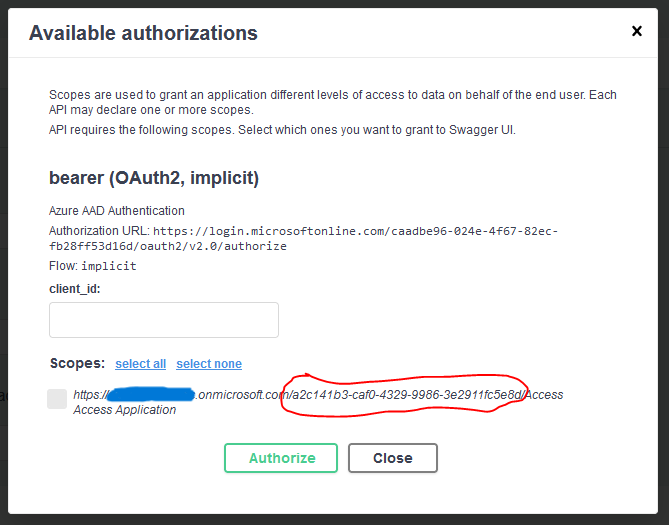

# Swagger Page Auto Login
The n-ate Swagger auto-login feature will automatically attempt to authenticate a user. This works via a Javascript script that programmatically clicks through the swagger page authentication GUI. **Note, if pop-ups are blocked auto-login will not work.**

In order for the auto-login feature to work. Authentication scope must be configured in a particular way. The **client_id** must be part of the scope. See below:

The following startup configurations are required and must be called in Program.cs or Startup.cs:

- AddFreshJwtBearerAuthentication()
- AddFreshSwaggerGen()
- AddControllers()    
- UseAuthentication()
- UseAuthorization()
- UseFreshSwagger()
- UseEndpoints()
- MapControllers()