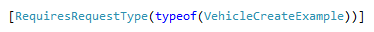
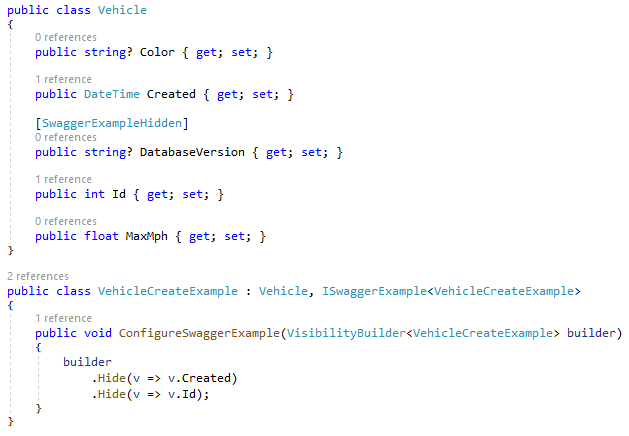
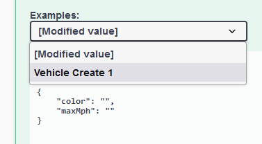

# Displaying Example Request Json
Displaying example JSON payloads on Swagger pages can help API consumers understand and begin using an API more quickly. There are 2 ways to control which members of a class are emitted.
1. SwaggerExampleHiddenAttribute
2. ISwaggerExample interface

Decoration of an endpoint is done with the **RequiresRequestTypeAttribute**.

  

Examples are implemented as classes. Below is the **Vehicle** class which the endpoint uses. The Example class below that inherits from the **Vehicle** class and implements **ISwaggerExample** which allows the hiding of particular members from the output JSON. Additionally, the **SwaggerExampleHiddenAttribute** can be used on the payload object as seen on the **Vehicle** class. 

  

  The emitted example request JSON:

  

In this way, the same class can be used for all Vehicle endpoints while generating a slightly different example payload that excludes unnecessary members.

//TODO: How to add preset values?

