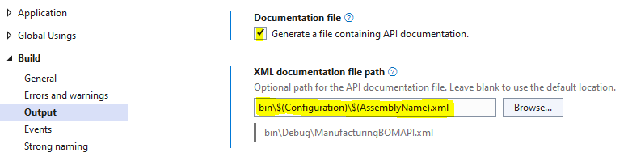

# n-ate Swagger General Setup

### Configuring Program.cs or Startup.cs

1. **Services configuration**

    Given `IServiceCollection services` and `IConfiguration Configuration`:

       services.AddFreshJwtBearerAuthentication( // [optional]
           Configuration["AzureAd:Instance"],
           Configuration["AzureAd:Domain"],
           Configuration["AzureAd:TenantId"],
           Configuration["AzureAd:ClientId"],
           Configuration["AzureAd:AppId"]
       );
       services.AddFreshSwaggerGen(); // [required]
       services.AddFreshHealthCheckEndpoints(); // [optional]
       services.AddFreshApiVersioning(); // [optional]
       services..AddControllers(); // [required]

2. **Application configuration**
    
     Given `IApplicationBuilder app`:
      
       app.UseWwwRootDirecortyAsStaticFilesRoot(); // [optional]
       app.UseRouting();
       app.UseAuthentication(); // [optional]
       app.UseAuthorization(); // [optional]
       app.UseFreshSwagger( // [required]
           _ => { },
           options => // [optional]
           {
               options.InjectJavascript("/js/swagger-extensions.js");
               options.InjectStylesheet("/css/swagger.css");
           }
       );
       app.UseEndpoints(builder => // [required]
           {
               builder.MapControllers(); // [required]
               builder.MapFreshHealthChecks(); // [optional]
               var getRoutesAction = () => builder.GetEndpointsAuditDocument(); // [optional]
           }
       );
       
### Configuring XML Documentation Generation

1. Right click on the API project that needs configuring
2. Click **Properties**
3. Click **Build**
4. Click **Output**
5. Check **Generate a file containing API documentation**
6. Set the **XML documentation file path** textbox to `bin\($Configuration)\$(AssemblyName).xml`

