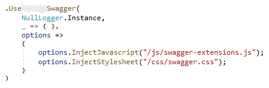
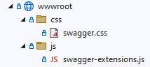

# Enhancing a Swagger HTML page 

Enhancing a Swagger page with **CSS** and **Javascript** can allow for an improved user experience. Additional content can be injected such as explanations, sample data, or even contact information.

- The following configurations must be called in **Program.cs** or **Startup.cs**:
  - AddFreshSwaggerGen()
  - AddControllers()
  - UseFreshSwagger()
  - UseEndpoints()
  - MapControllers()

- **UseFreshSwagger()** can be configured to inject Javascript and CSS.

   

- It is recommended that **UseWwwRootDirecortyAsStaticFilesRoot()** to register your **wwwroot** directory. This can be called in your **Program.cs** or **Startup.cs** before all other configuration steps.

- This is what your **wwwroot** directory might look like in Visual Studio.

   

