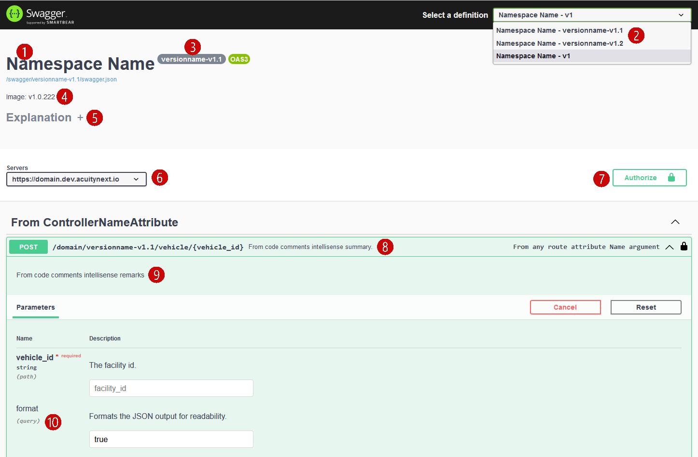

1. The project default namespace is automatically formatted for readability
2. Each API version is selectable in the definition dropdown
3. The current selected version, which can include a version name is displayed here
4. The build version from the Azure build pipeline can be enabled and shows here
5. Custom Javascript and CSS can be injected for additional functionality
6. The server of the current hosting domain is displayed here
7. Authorization is automatically performed for valid users
8. This comment is sourced from the class level summary intellisense tag

       ///&lt;summary>&lt;/summary> comment
9. This comment is sourced from the class level remarks intellisense tag

       ///&lt;remarks>&lt;/remarks> comment
10. Querystring parameters are supported via the [QueryStringParameterAttribute](//TODO:linktoMDpage)