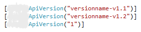
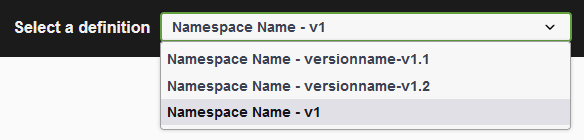
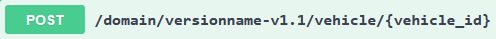
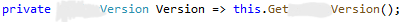

# Versioning

n-ate Swagger versioning includes [API versioning](#api-version) and displaying the [build version](#build-version) from the Azure pipeline. API versioning allows for named versions that are accessible through the definitions dropdown and easily tagged with the **FreshVersionAttribute**. Displaying the Azure pipeline build version number on Swagger pages can be useful to verify deployments against builds.

## API Versioning {#api-version}

- The following configurations must be called in **Program.cs** or **Startup.cs**:
  - AddFreshSwaggerGen()
  - AddControllers()    
  - UseFreshSwagger()
  - UseEndpoints()
  - AddFreshApiVersioning()
  - MapControllers()
- The **FreshVersionAttribute** decorates controller classes. It is **required**. (shown below with acceptable version strings)

     

  These defined versions are selectable from the definitions dropdown on the Swagger page.

     

  They are also emitted in the URL.
     
     
 - The **FreshVersion** can be programmatically accessed via any controller. (show below implemented as a property)

     

## Displaying the Build Version {#build-version}

//TODO: document pipeline build version setup

Adding Pipeline Build Version to Swagger pages
        yaml
        other pieces?

